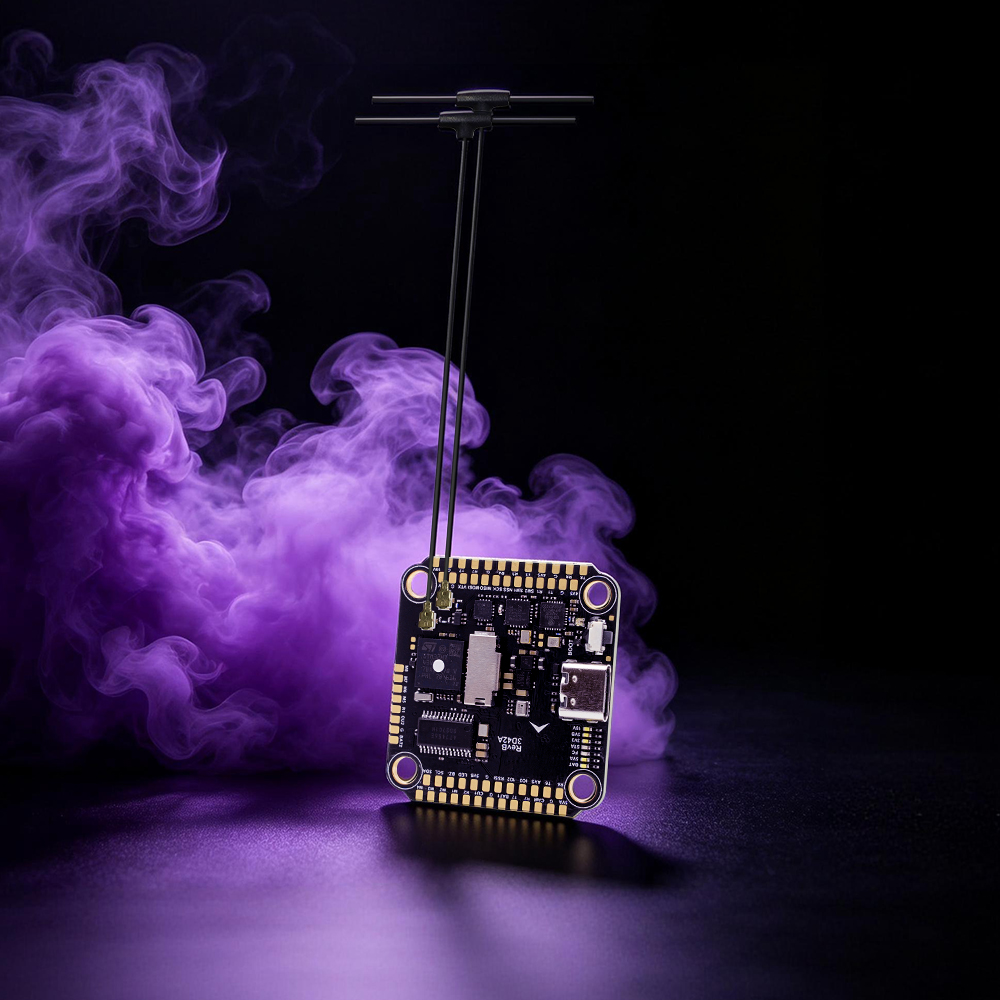
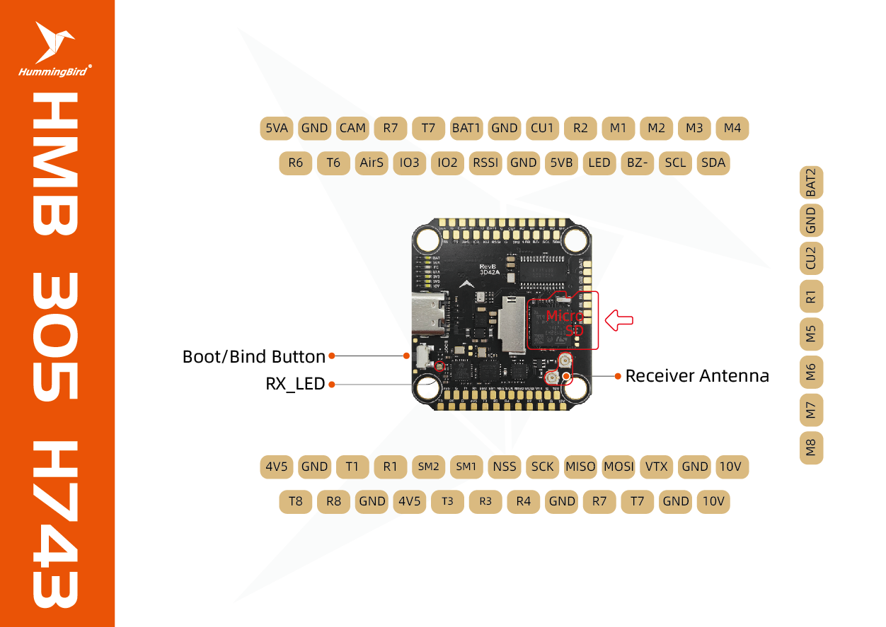
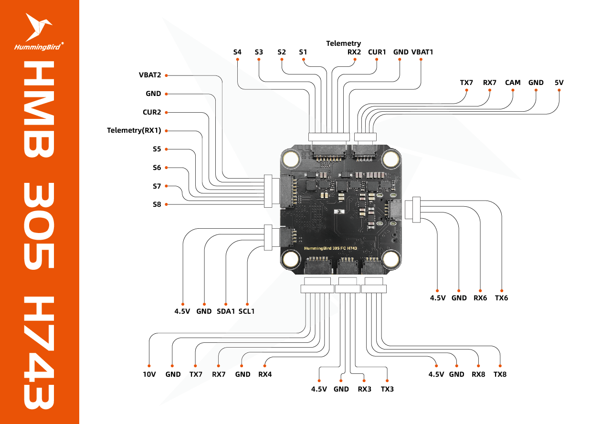

# NewBeeDrone HummingBird FC305 H7

::: warning
PX4 does not manufacture this (or any) autopilot.
Contact [NewBeeDrone](https://newbeedrone.com/) for hardware support or compliance issues.
:::

The **NewBeeDrone HummingBird FC305 H7** is a compact STM32H743-based flight controller designed for PX4-powered multirotors.
It provides eight DShot-capable motor outputs, two standard PWM servo outputs, a MicroSD card slot, dual battery monitoring, analog and digital OSD support, and multiple serial interfaces.



::: info
This flight controller is [manufacturer supported](../flight_controller/autopilot_manufacturer_supported.md).
:::

## Key Features

- FMU processor: STM32H743VI
  - 32-bit Arm Cortex-M7 running at up to 480 MHz
  - 2 MB flash memory and 1 MB RAM
- Sensors:
  - ICM-42688-P accelerometer/gyroscope on SPI
  - SPL06 barometer on I2C
- Eight DShot-capable motor outputs
- Two standard PWM servo outputs
- Eight hardware serial interfaces
- Dedicated CRSF and SBUS receiver interfaces
- MicroSD card slot
- Analog OSD using a MAX7456-compatible device
- MSP DisplayPort support for digital-video OSD
- Dual battery voltage and current monitoring
- External I2C and SPI interfaces
- Addressable RGB LED, beeper output, and 10 V BEC control
- USB Type-C connector

::: note
The board does not have an internal magnetometer.
PX4 defaults to magnetometer-free operation; connect an external compass to the I2C interface when one is required.
:::

## Connections and Pinouts

The following diagrams show the solder pads, connectors, and signal labels on both sides of the board.
Use the printed voltage labels when powering peripherals, and verify polarity before connecting power.

### Top Side and Solder Pads



The top-side diagram also identifies the boot/bind button, receiver status LED, receiver antenna connections, and MicroSD card slot.

### Bottom Side and Connectors



### Pin Label Reference

| Label                        | Function                                  |
| ---------------------------- | ----------------------------------------- |
| `M1` to `M8`                 | Motor signal outputs                      |
| `S1`, `S2`                   | Standard PWM servo outputs                |
| `Tn`, `Rn`                   | UART _n_ transmit and receive             |
| `SCL`, `SDA`                 | I2C clock and data                        |
| `NSS`, `SCK`, `MISO`, `MOSI` | External SPI interface                    |
| `BAT` / `VBAT`               | Battery-voltage connection or measurement |
| `CUR`                        | Current-sensor input                      |
| `CAM`, `VTX`                 | Analog-video input and output             |
| `RSSI`                       | Analog receiver signal-strength input     |
| `BZ-`                        | Active-low beeper output                  |
| `GND`                        | Ground                                    |

## Serial Port Mapping

| UART   | Device       | Board connection and intended use                                          |
| ------ | ------------ | -------------------------------------------------------------------------- |
| USART1 | `/dev/ttyS0` | ESC serial telemetry for `S5`-`S8`; external UART (`T1` / `R1`) when unused |
| USART2 | `/dev/ttyS1` | ESC serial telemetry for `S1`-`S4`; external UART (`T2` / `R2`) when unused |
| USART3 | `/dev/ttyS2` | GPS1 (`T3` / `R3`)                                                         |
| UART4  | `/dev/ttyS3` | EXT2 / SBUS (`T4` / `R4`)                                                  |
| UART5  | `/dev/ttyS4` | RC / CRSF                                                                  |
| USART6 | `/dev/ttyS5` | UART6 (`T6` / `R6`)                                                        |
| UART7  | `/dev/ttyS6` | MSP DisplayPort (`T7` / `R7`)                                              |
| UART8  | `/dev/ttyS7` | GPS2 (`T8` / `R8`)                                                         |

### ESC Serial Telemetry and External UART Use

UART1 is routed for ESC serial telemetry from the `S5`-`S8` output group, while UART2 is routed for telemetry from the `S1`-`S4` output group.
When ESC serial telemetry is not used on a group, its UART can instead be connected to an external serial peripheral through the corresponding transmit and receive pads.

PX4 starts DShot ESC serial telemetry on UART2 (`/dev/ttyS1`) by default.
UART1 remains available for configuration according to the vehicle's requirements.

::: note
UART7 occupies the logical PX4 `TEL4` serial-port slot, but it is configured as the MSP DisplayPort interface rather than a telemetry connector.
:::

## Radio Control

PX4 configures independent receiver inputs by default:

- CRSF on UART5, with CRSF telemetry enabled.
- SBUS on UART4.

See [Radio Control Setup](../getting_started/rc_transmitter_receiver.md) for transmitter and receiver configuration.

## OSD

The board supports two OSD paths:

- **Analog video:** the onboard MAX7456-compatible OSD is connected through SPI4. Set `OSD_ATXXXX_CFG` to `1` for NTSC or `2` for PAL.
- **Digital video:** MSP DisplayPort is configured on UART7.

## Building Firmware

To [build PX4](../dev_setup/building_px4.md) for this target:

```sh
make newbeedrone_hummingbird_fc305_h7_default
```

## Installing PX4 Firmware

The firmware can be installed in either of the normal ways:

- Build and upload the source:

  ```sh
  make newbeedrone_hummingbird_fc305_h7_default upload
  ```

- [Load the firmware](../config/firmware.md) using _QGroundControl_.

## Supported Platforms

The board is intended primarily for multirotors and provides eight DShot motor outputs and two standard PWM servo outputs.
Available configurations are listed in the [Airframes Reference](../airframes/airframe_reference.md).
