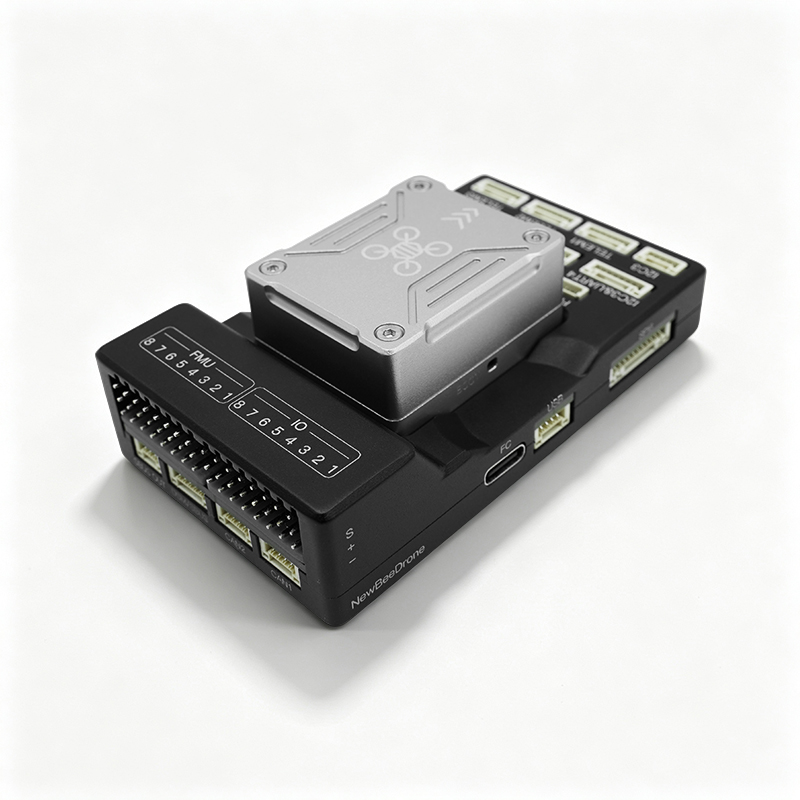
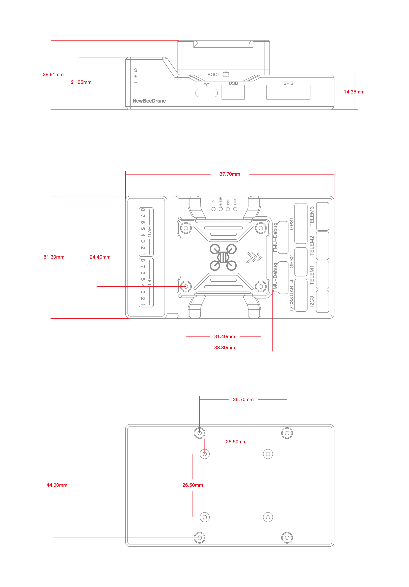

# NewBeeDrone PixNova

::: warning
PX4 does not manufacture this (or any) autopilot.
Contact NewBeeDrone for hardware support or compliance issues.
:::

The _NewBeeDrone PixNova_ is a modular flight controller built around an STM32H753 FMU processor and an STM32F100 I/O processor.
It provides redundant onboard sensors and a broad range of interfaces for PX4-powered vehicles.



::: info
This flight controller is [manufacturer supported](../flight_controller/autopilot_manufacturer_supported.md).
:::

## Key Features

- **FMU processor:** STM32H753 (32-bit Arm® Cortex®-M7, 480 MHz, 2 MB flash, 1 MB RAM)
- **I/O processor:** STM32F100
- **IMUs:** 3x ICM-45686
- **Barometers:** ICP-20100 and BMP388
- **Magnetometer:** IST8310
- **Interfaces:**
  - 16 PWM outputs (8 FMU and 8 I/O)
  - 3 telemetry ports
  - 2 GPS ports
  - 2 CAN buses
  - Ethernet
  - External I2C and SPI
  - PPM, SBUS, and DSM RC connections
  - 2 power module inputs
  - USB Type-C

## Connections and Pinouts

The following diagram shows the connector locations and pin assignments for the PixNova flight controller.


## Dimensions

The following drawing shows the overall dimensions and mounting-hole spacing in millimetres.



## Building Firmware

::: tip
Most users will not need to build this firmware.
It is pre-built and automatically installed by _QGroundControl_ when appropriate hardware is connected.
:::

To [build PX4](../dev_setup/building_px4.md) for this target from source:

```sh
make newbeedrone_pixnova_default
```
